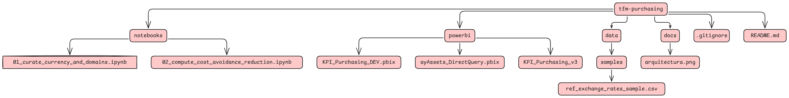

# TFM – Integración SCADA + SAP (Compras & Producción)

## Contenido
- `notebooks/01_curate_currency_and_domains.ipynb`  
  Curación desde *staging*: conversión a USD con tabla de tipos de cambio, homogeneización y controles básicos de integridad. Escribe tablas `cur.*` y `qa.curate_integrity_issues`.
- `notebooks/02_compute_cost_avoidance_reduction.ipynb`  
  Cálculo de **Cost Avoidance** (Before_RtB) y **Cost Reduction** (After_RtB y AnyButConstruction). Escribe `fact.*` y `mart.kpi_purchasing_totals`.
- `powerbi/KPI_Purchasing_DEV.pbix`  
  Informe de Power BI conectado al modelo publicado.
- `data/samples/`  
  Pequeños datos de ejemplo (no sensibles) para probar localmente la lógica de conversión a USD.

## Estructura



## Requisitos
- Workspace de **Azure Synapse** con Spark pool.
- **Azure SQL** / Synapse SQL para tablas `stg_*`, `cur`, `fact`, `mart`, `qa`.
- Tabla de tipos de cambio: `ref.exchange_rates_atlantica_2024_mod` con columnas `Currency`, `AvgRate`.

## Cómo ejecutar
1. Abre **01_curate_currency_and_domains.ipynb** en Synapse.
2. Ajustando los parámetros al inicio (catálogo y nombres de BD/tablas), ejecuta todo.  
   Salidas: `cur.bid_construction_curated`, `cur.bid_anybutconstruction_curated`, `qa.curate_integrity_issues`.
3. Abre **02_compute_cost_avoidance_reduction.ipynb** y ejecuta.  
   Salidas: `fact.cost_avoidance_construction_project`,  
   `fact.cost_reduction_construction_project`,  
   `fact.cost_reduction_anybut_prq`,  
   `mart.kpi_purchasing_totals`.
4. Abrir **KPI_Purchasing_DEV.pbix** y apuntar el modelo a tu instancia (credenciales/DSN).  
   Recomendado: **Import con incremental refresh**; DirectQuery solo para vistas muy recientes.

## Variables (en los notebooks)
```python
CATALOG = ""         
DB_STAGING = "stg_sap"
DB_REF = "ref"
DB_CUR = "cur"
DB_QA = "qa"
DB_FACT = "fact"
DB_MART = "mart"
